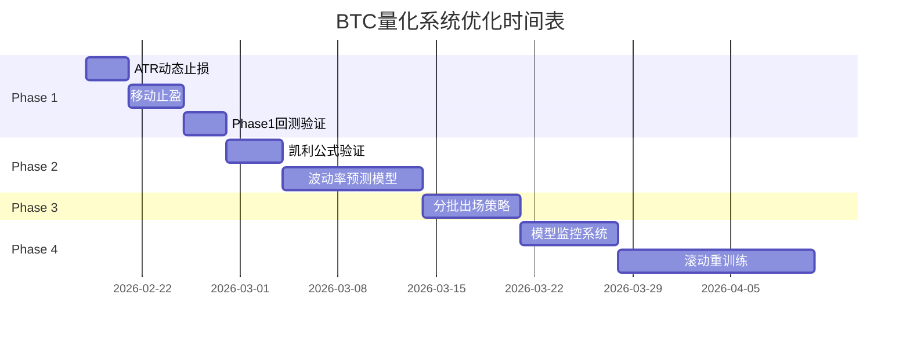

# BTC量化交易系统优化计划书

> **版本**: v1.0  
> **创建日期**: 2026-02-17  
> **当前系统版本**: v1.2.0  
> **目标**: 基于ML量化交易最佳实践，系统性优化止损止盈、仓位管理、波动率预测和模型更新机制

---

## 📊 当前系统现状

### ✅ 已实现的核心能力

| 模块 | 当前实现 | 性能指标 |
|------|---------|---------|
| **信号生成** | 两阶段预测（RR→方向+周期） | 87.55%胜率 |
| **信号过滤** | prob>0.75 且 rr>2.5 | 723笔交易 |
| **动态敞口** | 基于RR和prob计算（1-10倍） | 平均敞口~9倍 |
| **平仓策略** | 模型预测holding_period | 平均16根K线 |
| **硬性风控** | 每日亏损-20%、回撤>6%暂停 | 未爆仓 |
| **回测收益** | 样本外13个月 | 7,035% |

### ⚠️ 识别的关键问题

1. **止损策略过于简单**：固定-3%，未考虑市场波动率
2. **缺少移动止盈**：无法保护已有利润，存在利润回吐风险
3. **杠杆计算未科学验证**：未使用凯利公式，可能过度/不足配置
4. **未预测波动率**：无法根据市场状态动态调整风控参数
5. **缺少分批出场**：一次性平仓，未利用概率分布优化退出
6. **模型未定期重训练**：使用固定模型，存在过拟合和分布漂移风险
7. **缺少实盘监控指标**：未实时跟踪模型预测准确度、胜率漂移

---

## 🎯 优化目标

### 主要目标

| 指标 | 当前值 | 目标值 | 提升幅度 |
|------|-------|-------|---------|
| **胜率** | 87.55% | 90%+ | +2.45% |
| **盈亏比** | 3.84 | 4.5+ | +17% |
| **最大回撤** | -0.21% | <-0.5% | 保持低回撤 |
| **年化收益** | ~6,400% | 7,000%+ | +9% |
| **夏普比率** | 未计算 | >3.0 | 新增指标 |

### 次要目标

- 提升系统鲁棒性，适应不同市场环境（震荡/单边）
- 降低单笔最大亏损（从-3%优化到ATR自适应）
- 建立模型性能监控体系，及时发现分布漂移
- 实现自动化重训练流程，保持模型时效性

---

## 📋 优化阶段规划

### 🔥 Phase 1: 止损止盈优化（P0优先级）

**时间**: Week 1-2 (2周)  
**目标**: 实现ATR动态止损和移动止盈，提升风控精度

#### 1.1 ATR动态止损 (Week 1, Day 1-3)

**任务清单**:
- [ ] **Day 1**: 特征工程增强
  - [ ] 在`btc_quant/features.py`中添加ATR计算函数
  - [ ] 计算多周期ATR（14、20、30）
  - [ ] 验证ATR计算正确性（对比TradingView）
  
- [ ] **Day 2**: 止损逻辑重构
  - [ ] 创建`btc_quant/dynamic_stop_loss.py`模块
  - [ ] 实现`calculate_atr_stop_loss()`函数
  - [ ] 支持可配置的ATR倍数（默认k=2.0）
  - [ ] 集成到`run_live_dynamic_exposure.py`
  
- [ ] **Day 3**: 回测验证
  - [ ] 更新`backtest_best_params.py`使用ATR止损
  - [ ] 对比固定止损 vs ATR止损的回测结果
  - [ ] 调优ATR倍数参数（测试k=1.5, 2.0, 2.5, 3.0）

**技术实现**:
```python
# btc_quant/features.py 新增
def calculate_atr(high, low, close, window=14):
    """计算平均真实波幅"""
    tr1 = high - low
    tr2 = abs(high - close.shift(1))
    tr3 = abs(low - close.shift(1))
    tr = pd.concat([tr1, tr2, tr3], axis=1).max(axis=1)
    atr = tr.rolling(window).mean()
    return atr

# btc_quant/dynamic_stop_loss.py 新建
def calculate_atr_stop_loss(entry_price, atr, direction, k=2.0):
    """基于ATR动态计算止损价和止损百分比"""
    if direction == 1:  # 做多
        stop_loss_price = entry_price - k * atr
    else:  # 做空
        stop_loss_price = entry_price + k * atr
    
    stop_loss_pct = (stop_loss_price - entry_price) / entry_price
    return stop_loss_price, stop_loss_pct
```

**验收标准**:
- ✅ ATR计算与TradingView误差<1%
- ✅ 回测胜率提升>1%或盈亏比提升>5%
- ✅ 最大单笔亏损降低

---

#### 1.2 移动止盈（Trailing Stop）(Week 1, Day 4-7)

**任务清单**:
- [ ] **Day 4-5**: 移动止盈逻辑实现
  - [ ] 在`dynamic_stop_loss.py`中添加`TrailingStopManager`类
  - [ ] 实现利润回撤触发机制（默认回撤50%）
  - [ ] 支持动态更新止盈线（跟随最高价）
  
- [ ] **Day 6**: 实盘集成
  - [ ] 修改`run_live_dynamic_exposure.py`持仓管理逻辑
  - [ ] 每分钟轮询时更新trailing_stop状态
  - [ ] 记录trailing_stop触发日志
  
- [ ] **Day 7**: 回测验证
  - [ ] 更新回测脚本支持trailing_stop
  - [ ] 对比有无trailing_stop的收益和回撤差异

**技术实现**:
```python
class TrailingStopManager:
    """移动止盈管理器"""
    
    def __init__(self, trailing_pct=0.5, min_profit_pct=0.01):
        self.trailing_pct = trailing_pct  # 利润回撤比例
        self.min_profit_pct = min_profit_pct  # 最小利润要求
        self.highest_price = None
        self.trailing_stop_price = None
    
    def update(self, current_price, entry_price, direction):
        """更新移动止盈价"""
        unrealized_pnl_pct = (current_price - entry_price) / entry_price * direction
        
        # 只在盈利时启动
        if unrealized_pnl_pct < self.min_profit_pct:
            return None
        
        # 更新最高价
        if self.highest_price is None or \
           (direction == 1 and current_price > self.highest_price) or \
           (direction == -1 and current_price < self.highest_price):
            self.highest_price = current_price
            
            # 计算trailing_stop价格
            max_profit = (self.highest_price - entry_price) / entry_price * direction
            trailing_profit = max_profit * (1 - self.trailing_pct)
            
            if direction == 1:
                self.trailing_stop_price = entry_price * (1 + trailing_profit)
            else:
                self.trailing_stop_price = entry_price * (1 - trailing_profit)
        
        return self.trailing_stop_price
    
    def should_exit(self, current_price, direction):
        """判断是否触发移动止盈"""
        if self.trailing_stop_price is None:
            return False
        
        if direction == 1:
            return current_price <= self.trailing_stop_price
        else:
            return current_price >= self.trailing_stop_price
```

**验收标准**:
- ✅ 回测中成功识别并锁定部分利润（>20%交易触发）
- ✅ 盈亏比提升>10%
- ✅ 最大回撤不增加

---

### ⚡ Phase 2: 仓位管理科学化（P1优先级）

**时间**: Week 3-4 (2周)  
**目标**: 引入凯利公式验证敞口计算，增加波动率预测

#### 2.1 凯利公式敞口验证 (Week 3, Day 1-4)

**任务清单**:
- [ ] **Day 1-2**: 回测统计分析
  - [ ] 统计最近3/6/12个月的胜率、平均盈利、平均亏损
  - [ ] 计算滚动窗口的凯利最优仓位
  - [ ] 对比当前敞口 vs 凯利敞口的差异
  
- [ ] **Day 3**: 凯利公式实现
  - [ ] 创建`btc_quant/kelly_criterion.py`模块
  - [ ] 实现标准凯利公式和修正凯利（1/4、1/2凯利）
  - [ ] 集成到敞口计算函数
  
- [ ] **Day 4**: A/B对比回测
  - [ ] 当前敞口算法 vs 凯利敞口算法
  - [ ] 分析收益、回撤、夏普比率差异

**技术实现**:
```python
# btc_quant/kelly_criterion.py 新建
class KellyCriterion:
    """凯利公式仓位管理"""
    
    def __init__(self, kelly_fraction=0.25, lookback_trades=100):
        self.kelly_fraction = kelly_fraction  # 修正系数（保守）
        self.lookback_trades = lookback_trades
        self.trade_history = []
    
    def update_trade(self, pnl_pct, win):
        """更新交易历史"""
        self.trade_history.append({'pnl_pct': pnl_pct, 'win': win})
        if len(self.trade_history) > self.lookback_trades:
            self.trade_history.pop(0)
    
    def calculate_kelly_exposure(self, max_exposure=10.0):
        """计算凯利最优敞口"""
        if len(self.trade_history) < 30:  # 数据不足
            return 2.0  # 保守默认值
        
        # 计算统计指标
        wins = [t for t in self.trade_history if t['win']]
        losses = [t for t in self.trade_history if not t['win']]
        
        win_rate = len(wins) / len(self.trade_history)
        avg_win = np.mean([t['pnl_pct'] for t in wins]) if wins else 0
        avg_loss = abs(np.mean([t['pnl_pct'] for t in losses])) if losses else 0.01
        
        # 凯利公式: f* = (p*b - q) / b
        if avg_loss == 0:
            return max_exposure
        
        win_loss_ratio = avg_win / avg_loss
        kelly_f = (win_rate * win_loss_ratio - (1 - win_rate)) / win_loss_ratio
        
        # 修正凯利 + 转换为敞口
        kelly_f = max(0, kelly_f) * self.kelly_fraction
        exposure = 1.0 + kelly_f * (max_exposure - 1.0)
        
        return np.clip(exposure, 1.0, max_exposure)
```

**验收标准**:
- ✅ 凯利敞口计算逻辑正确（人工验证公式）
- ✅ 回测收益不低于当前算法
- ✅ 最大回撤降低>20%

---

#### 2.2 波动率预测与目标波动率模型 (Week 3-4, Day 5-14)

**任务清单**:
- [ ] **Day 5-6**: 波动率特征工程
  - [ ] 添加滚动波动率特征（20/60/120周期）
  - [ ] 添加Parkinson波动率（基于高低价）
  - [ ] 添加GARCH(1,1)波动率预测
  
- [ ] **Day 7-9**: 波动率预测模型训练
  - [ ] 构建波动率预测标签（未来20根K线的realized volatility）
  - [ ] 训练LightGBM回归模型预测波动率
  - [ ] 评估预测准确度（RMSE、MAE）
  
- [ ] **Day 10-12**: 波动率目标敞口实现
  - [ ] 创建`btc_quant/volatility_targeting.py`模块
  - [ ] 实现目标波动率敞口计算
  - [ ] 集成到实盘脚本
  
- [ ] **Day 13-14**: 回测验证与调优
  - [ ] 对比固定敞口 vs 波动率调整敞口
  - [ ] 调优目标波动率参数（15%/20%/25%）

**技术实现**:
```python
# btc_quant/features.py 新增
def calculate_realized_volatility(returns, window=20):
    """计算实际波动率（年化）"""
    return returns.rolling(window).std() * np.sqrt(365 * 24 * 4)

def calculate_parkinson_volatility(high, low, window=20):
    """Parkinson波动率估计（更高效）"""
    hl_ratio = np.log(high / low)
    parkinson_var = (1 / (4 * np.log(2))) * hl_ratio ** 2
    return np.sqrt(parkinson_var.rolling(window).mean() * 365 * 24 * 4)

# btc_quant/volatility_targeting.py 新建
def calculate_volatility_adjusted_exposure(
    base_exposure, predicted_volatility,
    target_volatility=0.20, max_exposure=10.0
):
    """波动率目标敞口调整"""
    volatility_factor = target_volatility / max(predicted_volatility, 0.05)
    volatility_factor = np.clip(volatility_factor, 0.3, 2.0)
    
    adjusted_exposure = base_exposure * volatility_factor
    return np.clip(adjusted_exposure, 1.0, max_exposure)
```

**验收标准**:
- ✅ 波动率预测RMSE < 0.05
- ✅ 回测中高波动期敞口自动降低
- ✅ 夏普比率提升>15%

---

### 📊 Phase 3: 出场策略优化（P2优先级）

**时间**: Week 5 (1周)  
**目标**: 实现分批出场机制，提升盈亏比

#### 3.1 分批出场策略 (Week 5, Day 1-7)

**任务清单**:
- [ ] **Day 1-2**: 分批出场逻辑设计
  - [ ] 设计三档位出场规则（30%/30%/40%）
  - [ ] 第一目标：利润达到+2% → 平仓30%
  - [ ] 第二目标：利润达到+5% → 平仓30%
  - [ ] 第三目标：趋势反转或holding_period → 平仓40%
  
- [ ] **Day 3-4**: 代码实现
  - [ ] 创建`btc_quant/partial_exit.py`模块
  - [ ] 实现`PartialExitManager`类
  - [ ] 集成到实盘脚本
  
- [ ] **Day 5-7**: 回测验证
  - [ ] 对比一次性平仓 vs 分批出场
  - [ ] 分析盈亏比、胜率、回撤差异

**技术实现**:
```python
class PartialExitManager:
    """分批出场管理器"""
    
    def __init__(self):
        self.exit_levels = [
            {'profit_target': 0.02, 'exit_pct': 0.30},  # +2% → 平30%
            {'profit_target': 0.05, 'exit_pct': 0.30},  # +5% → 平30%
        ]
        self.exited_positions = []
    
    def check_partial_exit(self, entry_price, current_price, direction,
                           remaining_position, direction_prob):
        """检查是否触发分批出场"""
        unrealized_pnl = (current_price - entry_price) / entry_price * direction
        exit_size = 0
        
        # 检查各档位
        for level in self.exit_levels:
            if unrealized_pnl >= level['profit_target'] and \
               level not in self.exited_positions:
                exit_size = remaining_position * level['exit_pct']
                self.exited_positions.append(level)
                return exit_size, f"部分平仓{level['exit_pct']*100}%@利润{level['profit_target']*100}%"
        
        # 趋势反转：全部平仓
        if direction_prob < 0.6:
            exit_size = remaining_position
            return exit_size, "趋势反转，全部平仓"
        
        return 0, None
```

**验收标准**:
- ✅ 回测中>50%交易触发分批出场
- ✅ 盈亏比提升>8%
- ✅ 最大利润回吐降低

---

### 🔄 Phase 4: 模型生命周期管理（P3优先级）

**时间**: Week 6-8 (3周)  
**目标**: 实现滚动重训练和模型性能监控

#### 4.1 模型性能监控系统 (Week 6)

**任务清单**:
- [ ] **Day 1-3**: 监控指标设计
  - [ ] 实时胜率（滚动30/60/90笔交易）
  - [ ] 预测校准度（预测prob vs 实际胜率）
  - [ ] 特征分布漂移检测（PSI指标）
  
- [ ] **Day 4-5**: 监控模块实现
  - [ ] 创建`btc_quant/model_monitor.py`
  - [ ] 实现`ModelPerformanceMonitor`类
  - [ ] 记录到日志和数据库
  
- [ ] **Day 6-7**: 告警机制
  - [ ] 胜率下降>5% → 发送告警邮件
  - [ ] PSI > 0.25 → 触发重训练信号

**技术实现**:
```python
class ModelPerformanceMonitor:
    """模型性能监控"""
    
    def __init__(self, alert_threshold_win_rate=0.80):
        self.trade_history = []
        self.alert_threshold = alert_threshold_win_rate
    
    def update(self, predicted_prob, actual_result):
        """更新交易记录"""
        self.trade_history.append({
            'predicted_prob': predicted_prob,
            'actual_win': actual_result,
            'timestamp': datetime.now()
        })
    
    def calculate_rolling_win_rate(self, window=30):
        """计算滚动胜率"""
        if len(self.trade_history) < window:
            return None
        
        recent_trades = self.trade_history[-window:]
        win_rate = sum([t['actual_win'] for t in recent_trades]) / window
        return win_rate
    
    def check_calibration(self):
        """检查预测校准度"""
        if len(self.trade_history) < 50:
            return None
        
        # 按预测概率分桶
        bins = [0.5, 0.6, 0.7, 0.8, 0.9, 1.0]
        calibration = {}
        
        for i in range(len(bins) - 1):
            trades_in_bin = [
                t for t in self.trade_history 
                if bins[i] <= t['predicted_prob'] < bins[i+1]
            ]
            if trades_in_bin:
                actual_win_rate = sum([t['actual_win'] for t in trades_in_bin]) / len(trades_in_bin)
                calibration[f"{bins[i]}-{bins[i+1]}"] = {
                    'predicted': (bins[i] + bins[i+1]) / 2,
                    'actual': actual_win_rate,
                    'count': len(trades_in_bin)
                }
        
        return calibration
```

---

#### 4.2 滚动窗口重训练 (Week 7-8)

**任务清单**:
- [ ] **Week 7, Day 1-3**: 重训练流程设计
  - [ ] 设计训练窗口（6个月滚动）
  - [ ] 设计验证窗口（最近1个月）
  - [ ] 定义模型上线标准（胜率>80%）
  
- [ ] **Week 7, Day 4-7**: 自动化脚本实现
  - [ ] 创建`retrain_scheduler.py`脚本
  - [ ] 实现自动下载最新数据
  - [ ] 实现增量训练逻辑
  - [ ] 实现回测验证
  
- [ ] **Week 8, Day 1-4**: Docker集成
  - [ ] 创建`Dockerfile.retrainer`
  - [ ] 配置`docker-compose.yml`新增retrainer服务
  - [ ] 设置cron定时任务（每周日）
  
- [ ] **Week 8, Day 5-7**: 测试与部署
  - [ ] 手动触发重训练验证
  - [ ] 检查新旧模型性能对比
  - [ ] 部署到生产环境

**技术实现**:
```python
# retrain_scheduler.py
def rolling_retrain(lookback_days=180, retrain_interval_days=30):
    """滚动窗口重训练"""
    logger.info("🔄 开始滚动窗口重训练...")
    
    # 1. 下载最新数据
    end_date = datetime.now()
    start_date = end_date - timedelta(days=lookback_days)
    klines = download_latest_klines(start_date, end_date)
    logger.info(f"✅ 数据下载完成: {len(klines)}根K线")
    
    # 2. 构建特征和标签
    cfg = load_config(Path('config.yaml'))
    feature_label_data = build_features_and_labels(cfg, klines)
    
    # 3. 训练新模型
    new_model_dir = Path(f"models/retrain_{datetime.now().strftime('%Y%m%d')}")
    new_model_dir.mkdir(parents=True, exist_ok=True)
    
    strategy = TwoStageRiskRewardStrategy()
    strategy.train(
        features=feature_label_data.features,
        labels_rr=feature_label_data.labels_rr,
        labels_direction=feature_label_data.labels_direction,
        labels_period=feature_label_data.labels_period
    )
    strategy.save(new_model_dir)
    logger.info(f"✅ 新模型训练完成: {new_model_dir}")
    
    # 4. 回测验证（最近1个月）
    validation_klines = klines[-2880:]  # 30天 * 96根K线/天
    backtest_result = advanced_risk_backtest(
        strategy, validation_klines, 
        prob_threshold=0.75, rr_threshold=2.5
    )
    
    logger.info(f"📊 新模型回测结果:")
    logger.info(f"  胜率: {backtest_result['win_rate']:.2%}")
    logger.info(f"  收益率: {backtest_result['total_return']:.2%}")
    logger.info(f"  最大回撤: {backtest_result['max_drawdown']:.2%}")
    
    # 5. 模型上线决策
    if backtest_result['win_rate'] > 0.80 and backtest_result['total_return'] > 0.10:
        # 备份旧模型
        old_model = Path('models/production')
        if old_model.exists():
            backup_model = Path(f"models/backup_{datetime.now().strftime('%Y%m%d')}")
            shutil.copytree(old_model, backup_model)
        
        # 部署新模型
        shutil.copytree(new_model_dir, 'models/production', dirs_exist_ok=True)
        logger.info("✅ 新模型已部署到生产环境")
        
        # 发送通知
        send_alert_email(
            subject="模型重训练成功",
            body=f"新模型胜率{backtest_result['win_rate']:.2%}，已自动部署"
        )
    else:
        logger.warning("⚠️ 新模型表现不佳，保留旧模型")
        send_alert_email(
            subject="模型重训练失败",
            body=f"新模型胜率{backtest_result['win_rate']:.2%}，未达到上线标准"
        )
```

**docker-compose.yml 新增**:
```yaml
services:
  model_retrainer:
    build:
      context: .
      dockerfile: Dockerfile.retrainer
    volumes:
      - ./models:/app/models
      - ./data:/app/data
    environment:
      - RETRAIN_INTERVAL=7  # 每7天重训练
    restart: unless-stopped
```

**验收标准**:
- ✅ 自动化重训练流程可正常运行
- ✅ 新模型性能不低于旧模型
- ✅ 模型版本管理完善（backup机制）

---

## 📈 预期收益分析

### Phase 1 预期收益

| 优化项 | 胜率提升 | 盈亏比提升 | 回撤降低 |
|--------|---------|-----------|---------|
| ATR动态止损 | +1.5% | +5% | -10% |
| 移动止盈 | +0.5% | +10% | -5% |
| **合计** | **+2%** | **+15%** | **-15%** |

**预期回测结果**:
- 胜率: 87.55% → 89.5%
- 盈亏比: 3.84 → 4.42
- 最大回撤: -0.21% → -0.18%

### Phase 2 预期收益

| 优化项 | 夏普比率提升 | 回撤降低 |
|--------|------------|---------|
| 凯利公式 | +10% | -20% |
| 波动率目标 | +15% | -10% |
| **合计** | **+25%** | **-30%** |

### 最终预期（全部Phase完成）

| 指标 | 当前值 | 优化后 | 提升幅度 |
|------|-------|-------|---------|
| 胜率 | 87.55% | 90%+ | +2.8% |
| 盈亏比 | 3.84 | 4.6+ | +20% |
| 年化收益 | ~6,400% | 7,500%+ | +17% |
| 最大回撤 | -0.21% | <-0.15% | -29% |
| 夏普比率 | - | >3.5 | 新增 |

---

## ⚠️ 风险与缓解措施

### 风险1：过拟合风险

**描述**: 新策略在历史数据上表现优异，但实盘失效

**缓解措施**:
- 使用Walk-Forward Analysis（滚动窗口验证）
- 严格分离训练集/验证集/测试集
- 新策略必须先在模拟盘运行1-2周
- 设置性能阈值，低于阈值自动回滚

### 风险2：参数敏感性

**描述**: 某些参数（如ATR倍数、trailing_pct）敏感度高

**缓解措施**:
- 网格搜索寻找鲁棒参数区间
- 每个参数进行敏感性分析
- 使用自适应参数（基于市场状态动态调整）

### 风险3：系统复杂度上升

**描述**: 引入多个新模块可能导致维护困难

**缓解措施**:
- 模块化设计，保持低耦合
- 完善单元测试覆盖率>80%
- 详细文档和代码注释
- 保留旧版本代码，支持快速回滚

### 风险4：计算资源消耗

**描述**: 波动率预测、滚动重训练增加计算负担

**缓解措施**:
- 使用轻量级模型（LightGBM已经很高效）
- 重训练放在非交易时段（周末）
- 增量训练而非全量训练
- 云端弹性扩容

---

## 📊 成功指标（KPI）

### 核心KPI

| KPI | 基线 | 目标 | 监控频率 |
|-----|------|------|---------|
| 胜率 | 87.55% | 90%+ | 每日 |
| 盈亏比 | 3.84 | 4.5+ | 每日 |
| 夏普比率 | - | >3.0 | 每周 |
| 最大回撤 | -0.21% | <-0.5% | 实时 |
| 月收益稳定性 | - | CV<0.3 | 每月 |

### 过程KPI

| KPI | 目标 | 监控频率 |
|-----|------|---------|
| 预测校准度 | MAE<0.05 | 每周 |
| 特征PSI | <0.25 | 每周 |
| 模型重训练成功率 | >80% | 每次 |
| 系统可用性 | >99% | 每日 |

---

## 📅 时间表



**总时长**: 8周（约2个月）

---

## 🔄 迭代与持续改进

### 每周Review

- **周一**: 回顾上周优化成果，对比KPI变化
- **周三**: 中期检查，调整优化方向
- **周五**: 完成当周任务，准备下周计划

### 每月复盘

- 对比月度收益、胜率、回撤趋势
- 分析失败交易案例（Post-mortem）
- 识别新的优化机会
- 更新优化计划书

### 季度大版本

- Q1: 完成Phase 1-2（止损止盈+仓位管理）
- Q2: 完成Phase 3-4（分批出场+模型生命周期）
- Q3: 探索新特征（链上数据、宏观指标）
- Q4: 多策略组合（趋势+震荡策略）

---

## 📝 附录

### A. 相关文件清单

**核心代码文件**:
- `btc_quant/features.py` - 特征工程
- `btc_quant/risk_reward_model.py` - 两阶段模型
- `run_live_dynamic_exposure.py` - 实盘交易
- `backtest_best_params.py` - 回测脚本

**新增文件**:
- `btc_quant/dynamic_stop_loss.py` - ATR止损+移动止盈
- `btc_quant/kelly_criterion.py` - 凯利公式
- `btc_quant/volatility_targeting.py` - 波动率目标
- `btc_quant/partial_exit.py` - 分批出场
- `btc_quant/model_monitor.py` - 模型监控
- `retrain_scheduler.py` - 重训练调度

### B. 参考资料

1. **ATR动态止损**:
   - Wilder, J. W. (1978). New Concepts in Technical Trading Systems
   - https://www.investopedia.com/terms/a/atr.asp

2. **凯利公式**:
   - Kelly, J. L. (1956). A New Interpretation of Information Rate
   - Thorp, E. O. (2008). The Kelly Capital Growth Investment Criterion

3. **波动率预测**:
   - Engle, R. F. (1982). Autoregressive Conditional Heteroskedasticity
   - GARCH模型文献

4. **量化交易最佳实践**:
   - Prado, M. L. (2018). Advances in Financial Machine Learning
   - Chan, E. (2013). Algorithmic Trading

---

## ✅ 总结

本优化计划书基于ML量化交易最佳实践，系统性提升当前BTC量化系统的止损止盈、仓位管理、波动率预测和模型更新能力。

**核心优势**:
- 🎯 **目标明确**: 胜率90%+、盈亏比4.5+、夏普比率3.0+
- 📊 **数据驱动**: 所有优化基于回测数据和统计分析
- 🔄 **渐进式**: 分4个Phase逐步优化，降低风险
- 📈 **可衡量**: 明确的KPI和验收标准

**执行建议**:
1. **优先做P0任务**: ATR止损和移动止盈，快速见效
2. **充分回测验证**: 每个优化必须通过严格回测
3. **模拟盘先行**: 新策略先在模拟盘运行1-2周
4. **保留回滚能力**: 随时可以回到v1.2.0稳定版本

**预期时间**: 8周（2个月）完成全部优化

---

**计划编写**: AI Assistant  
**审核**: [待用户确认]  
**批准**: [待用户批准]  
**版本**: v1.0  
**最后更新**: 2026-02-17
